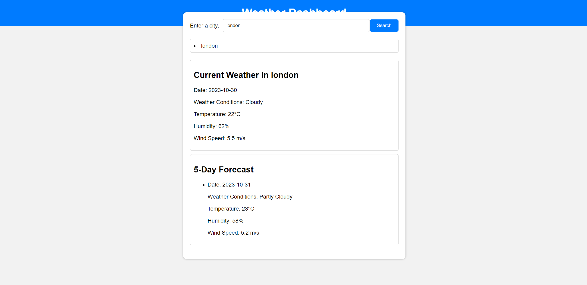

# Usama Server Side Api's

## Table of Contents

- Description
- Link
- User Story
- Deployed link

## Description

This project showcases the use of JavaScript, HTML, and CSS while showcasing an original take on interactive tests. It is a great option for both leisure and 
education because of its beautiful and user-friendly UI.

## Link

You can view the webiste by the following link: 
file:///C:/Users/uabdu/OneDrive/Desktop/Week-6-Server-Side-Usama/index.html
 

## User Story 
The app is a weather dashboard which gave the user access to specific weather data related to a city.

# Deployed Link

https://usamaali0909.github.io/Week-6-Server-Side-Usama/

## Screenshot of website 

